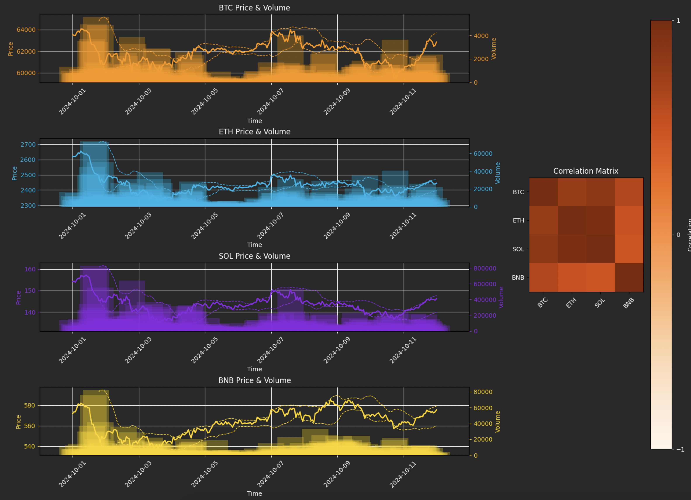

# crypto_corr_dashboard

- This project builds an interactive trading dashboard for **BTC**, **ETH**, **SOL**, and **BNB** using Tkinter and Matplotlib.
- It fetches hourly price and volume data, calculates Bollinger Bands, and displays charts alongside a correlation heatmap.

---

## Files
- `crypto_dashboard.py`: Main script for fetching price data, calculating indicators, and creating the Tkinter dashboard.
- No external dataset required; data is fetched live from Binance via `ccxt`.
- `dashboard.png`: Screenshot of the dashboard interface - Colors: `#FF9900` (BTC), `#00B7EB` (ETH), `#8A2BE2` (SOL), `#FFD700` (BNB).

---

## Libraries Used
- `numpy`
- `pandas`
- `ccxt`
- `datetime`
- `tkinter`
- `matplotlib.backends.backend_tkagg`
- `matplotlib.pyplot`
- `matplotlib.gridspec`

---

## Timeframe
- **Input**: Hourly price and volume data from **2024-10-01T00:00:00Z** to **2024-10-12T00:00:00Z** (configurable in code).
- **Output**: Dashboard displaying price, volume, Bollinger Bands, and correlation for this period.

---

## Features
- Fetches hourly price and volume data for BTC/USDT, ETH/USDT, SOL/USDT, and BNB/USDT from Binance.
- Calculates 20-period Bollinger Bands with 2 standard deviations for each cryptocurrency.
- Displays price and volume charts with Bollinger Bands for each coin in a 4x2 grid (left column).
- Shows a correlation heatmap of closing prices across all four coins (right column).
- Uses a dark-themed Tkinter GUI for an interactive experience.

---

## Screenshots

